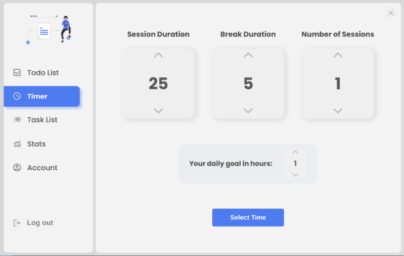
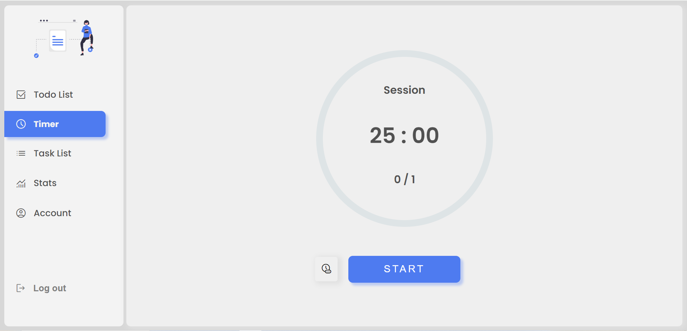
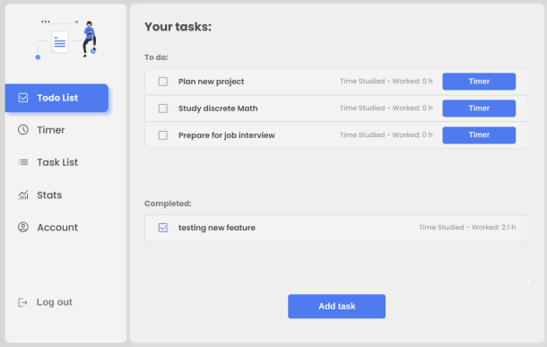

# **Timefrost (time management app)**

Timefrost is a productivity app where users can use a Pomodoro timer for their study sessions, create tasks, and mark them as completed in the TODO list. Users can select a task, use the Pomodoro timer to track their working/study time, and look at their daily statistics in the stats dashboard section.
## **Main Features**:
- **Pomodoro timer**: The users can select the study time and break time and select the amount of sessions they want to complete.
- **Automatic Cycling between sessions**: Once a session finishes, the break phase will start automatically, and when it finishes, the next session will start.
- **Tasks and TODO list**: Users can create tasks and mark them as complete.
- **Worked time added to tasks**: A user can select a task and start a Pomodoro timer for that particular task.
- **Statistics dashboard**: Users can see a statistical summary of their study time.
- **Authentication and authorization**: Only registered users can create tasks and use the Pomodoro timer. Users can only modify or delete the tasks that belong to them.





## **Technologies used**:
- **NodeJs, Express, and MongoDb for the backend**: https://github.com/IceHenki6/time-management-app-backend
- **ReactJs**
    - **Libraries used**: 
        - **Axios**: For making api calls
        - **Date-fns**: Toolset to manipulate dates
        - **Recharts**: For the charts in the stats dashboard
- **Vite**: For setting up the project


## **Installation (frontend)**:
### Requirements:
- NodeJs and NPM
### Steps:
1. Clone this repository in the folder of your choice:
```bash
git clone https://github.com/IceHenki6/time-management-app.git
```
2. Go to the folder where the project is located
```bash
cd time-management-app
```
3. Run npm install
```bash
npm install
```
4. Run the project:
```bash
npm run dev
```

>Notice that the project needs the backend running, instructions for this will be given in the backend repo: https://github.com/IceHenki6/time-management-app-backend

### Additional note:
This project is a continuation of this repo https://github.com/IceHenki6/time-management-project, that was made with **create-react-app**, in this "new version" **Vite** was used to setup the project. 
**create-react-app** and **Vite** are tools used to set up and build React apps, the reason for starting over with **Vite** is due to the faster start times and better developer experience compared to **create-react-app**.


 

